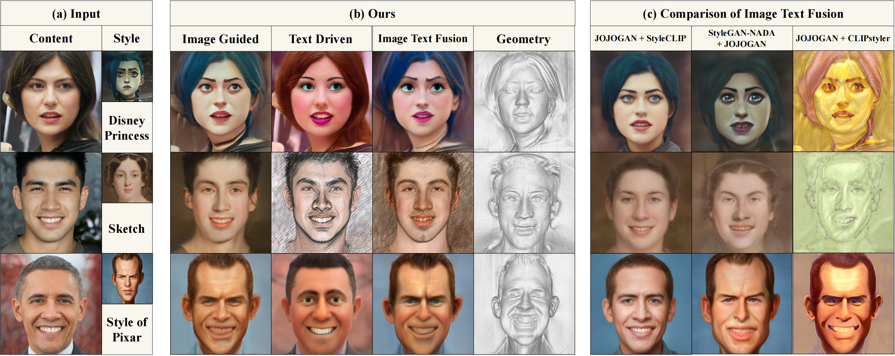

# ITportrait: Image-Text Coupled 3D Portrait Domain Adaptation
<center class="half">
    
</center>

### The continuity of the generated results.

<center class="half">
    
</center>


### 3D view of the generated results

<center class="half">
    
</center>


## Requirements
Pretrained EG3D generator (can be downloaded from [ffhq512-128.pkl](https://catalog.ngc.nvidia.com/orgs/nvidia/teams/research/models/eg3d/files)).  
Pretrained e4e encoder (can be downloaded from [e4e_ffhq_encode.pt](https://github.com/yuval-alaluf/restyle-encoder)). 
Pretrained stylegan2- (can be downloaded from [
stylegan2-ffhq-config-f.pt](https://drive.google.com/file/d/1EM87UquaoQmk17Q8d5kYIAHqu0dkYqdT/view)). 
into
:
```
./checkpoints
```

- Anaconda
```
cd eg3d
conda env create -f env.yml
conda activate eg3d
pip install ftfy regex tqdm
pip install git+https://github.com/openai/CLIP.git
```


### Usage

#### 1）W project
Here we provide some examples in: 
```
./inputs
```

#### 2）Train


```
# Image-Text coupled domain adaption
CUDA_VISIBLE_DEVICES=4 python ZSSGAN/train.py \
--size 512 \
--batch 2  \
--n_sample 2  \
--output_dir ./output \
--lr 0.002  \
--frozen_gen_ckpt ./checkpoints/ffhqrebalanced512-128.pkl \
--iter 401  \
--source_class "Photo"  \
--target_class "Disney Princess"  \
--auto_layer_k 14 \
--auto_layer_iters 1  \
--auto_layer_batch 2  \
--output_interval 50  \
--clip_models "ViT-B/32" "ViT-B/16" \
--clip_model_weights 1.0 1.0  \
--mixing 0.0 \
--save_interval 100 \
--type "fusion" \
--input "./inputs/2"
```

```
# Image-guided style transfer
CUDA_VISIBLE_DEVICES=1 python ZSSGAN/train.py \
--size 512 \
--batch 2  \
--n_sample 2  \
--output_dir ./output \
--lr 0.002  \
--frozen_gen_ckpt ./checkpoints/ffhqrebalanced512-128.pkl \
--iter 401  \
--source_class "Photo"  \
--target_class "the style of pixar"  \
--auto_layer_k 14 \
--auto_layer_iters 1  \
--auto_layer_batch 2  \
--output_interval 50  \
--clip_models "ViT-B/32" "ViT-B/16" \
--clip_model_weights 1.0 1.0  \
--mixing 0.0 \
--save_interval 100 \
--type "only_img"  \
--input "./inputs/1"
```

```
# Text-driven manipulation
CUDA_VISIBLE_DEVICES=0 python ZSSGAN/train.py \
--size 512 \
--batch 2  \
--n_sample 2  \
--output_dir ./output \
--lr 0.002  \
--frozen_gen_ckpt ./checkpoints/ffhqrebalanced512-128.pkl \
--iter 401  \
--source_class "Photo"  \
--target_class "the style of pixar"  \
--auto_layer_k 14 \
--auto_layer_iters 1  \
--auto_layer_batch 2  \
--output_interval 50  \
--clip_models "ViT-B/32" "ViT-B/16" \
--clip_model_weights 1.0 1.0  \
--mixing 0.0 \
--save_interval 100 \
--type "only_text"  \
--input "./inputs/1"
```

#### 3）Render images
```
# Image-guided style transfer
CUDA_VISIBLE_DEVICES=0 python gen_images.py --outdir=./output_imgs --trunc=0.7 --shapes=False --seeds=1,2,3 --network=./output/checkpoint/000200_eg3d_imgstyle.pkl
```

```
# Text-driven manipulation
CUDA_VISIBLE_DEVICES=0 python gen_images.py --outdir=./output_imgs --trunc=0.7 --shapes=False --seeds=1,2,3 --network=output/checkpoint/000200_eg3d_mixstyle.pkl
```

```
# Image-Text coupled domain adaption
CUDA_VISIBLE_DEVICES=0 python gen_images.py --outdir=./output_imgs --trunc=0.7 --shapes=False --seeds=1,2,3 --network=./output/checkpoint/000400_eg3d_mixstyle.pkl
```


