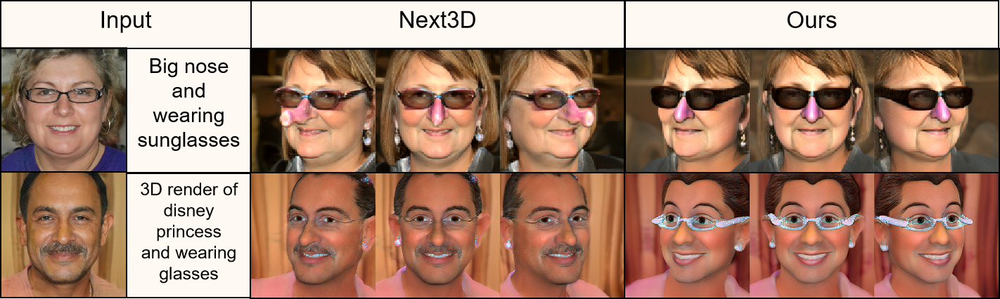

# ITportrait: Image-Text Coupled 3D Portrait Domain Adaptation

## 1) Video results

### 1.1) The continuity of the generated results.

    

### 1.2) 3D view of the generated results

    

### 2) Other disscusions.

#### 2.1) To Reviewer E54t:

> **Lack of some discussion with state-of-the-art methods, such as Next3D: Generative Neural Texture Rasterization for 3D-Aware Head Avatars.**

    

* As shown above our methods is better than Next3D. Because our 3D multi-view supervision not only plays the role of CLIP augment and thus gets better text-guided transfer(Fig.7) but also prevents geometry collapse(Fig.10). In contrast, The stylization method of Next3D is actually a 2D vision method( based on the StyleGAN-NADA[3]). Only 2D frontal supervision leads to an inferior effect(Fig.7) and geometric collapse(Fig.10).
* Besides, all experiments compared in this paper (Fig.1, Fig.5, Fig.6, Fig.7, Fig.10, Fig.12) are the SOTA methods, including, CLIPstyler (CVPR2022), StyleGAN-NADA (SIGGRAPH2022), JOJOGAN (ECCV2022), Your3dEmoji (SIGGRAPH2022), Dr.3d(SIGGRAPH2022), 3DAvatarGAN(CVPR2023), StyleCLIP (ICCV2021).

#### 2.2) To Reviewer AyL3:

> **In some images, there are visible changes in the coarse structure of the edited results, as shown in Figure 13. Specifically, in the third row, after a text edit that does not imply a smile, the woman's expression transforms into a smile. It is noteworthy that some text-guided methods, such as StyleCLIP, do not encounter such changes. Please provide further clarification on this matter. Similar to the above issue, the identity of the person may be altered.**

    

* The reason for the smile expression is that our 3D GAN inversion effect is not good. Although 3D GAN inversion reproduces this portrait, the wrinkles generated by **old-age** are **misidentified** as those generated by **happy-smile**. And the subsequent finetuning intensifies the expression of happy emotion. Therefore, there is an obvious smile in Fig.13 lines. StyleCLIP relies on 2D GAN inversion, which is currently more accurate[1,2,3,4] than 3D GAN inversion.
* It is noteworthy that this is the failure of the 3DGAN inversion, not the domain adaptation task we are focused on. With better 3D GAN inversion methods, our performance will be improved.

Reference:

[1] Yin, Fei, et al. "3d gan inversion with facial symmetry prior." CVPR. 2023.
[2] Xie, Jiaxin, et al. "High-fidelity 3D GAN Inversion by Pseudo-multi-view Optimization." CVPR. 2023.
[3] Roich, Daniel, et al. "Pivotal tuning for latent-based editing of real images." ACM Transactions on graphics (TOG) 42.1 (2022): 1-13.
[4] Alaluf, Yuval, et al. "Hyperstyle: Stylegan inversion with hypernetworks for real image editing." CVPR. 2022.
